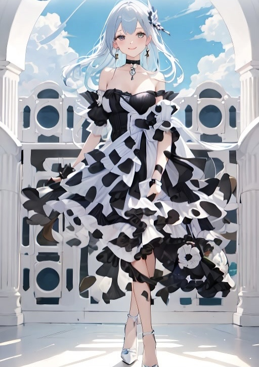

## About me

Work on  company, as an Front-End IDE development engineer

Develop product **HBuilderX** 

## What I use

    
    

    
    
    

    
    
    

    
    

    
    
    

    
    
    

## Contact me

    <!-- 第一个子项（内部垂直布局） -->
    

        

        

    

    <!-- 第二个子项 -->
    

        

        

    

    <!-- 第三个子项 -->
    

        

        
doyoung9508@126.com

    

